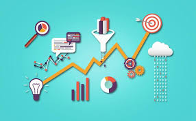

# Data Analyst

### Profile
Entry-level data analyst with a strong background in statistical analysis, data visualization, and SQL. Passionate about uncovering insights from complex datasets to drive informed business decisions.

### Technical Skills
  - Python
  - SQL
  - Microsoft Excel
  - Power BI
  - Tableau

### Education
-- **M.Sc. (Computing and IT)** UNSW, Australia (_2006_)

### Work Experience
**Research Assistant** University of Saskatchewan, Canada (_2016-2022_)
- Performed research in the field of health informatics, medical imaging, and internet-of-things (IoT).
- Conducted experiments and disseminated the findings through publications and presentations.

**Business Analyst** Innovation Enterprise, Canada (_2018-2020_)
- Performed market assessments to intellectual property (IP) developed by researchers.
- Created custom reports and dashboards of different technical, legal and financial KPIs.

### Certification
1. Unilever Supply Chain Data Analyst Professional Certificate 
   * [Supply Chain Management and Analytics](/assets/img/C1.pdf) (_May 2024_)
   * [Using Data Analytics in Supply Chain](/assets/img/C1.pdf) (_May 2024_)
   * [Implementing Supply Chain Analytics](/assets/img/C3.pdf) (_May 2024_)
   * Supply Chain Software Tools (In progress)

### Project
- [Impact of Manufacturing Delay on Supply Chain](https://medium.com/@hasan.ahmedmonjurul/impact-of-manufacturing-delay-on-supply-chain-21d361d3a52e)
- [Top 10 Programming Languages in 2019](https://medium.com/@hasan.ahmedmonjurul/top-10-programming-languages-in-2019-fbe63b059319)

- 
