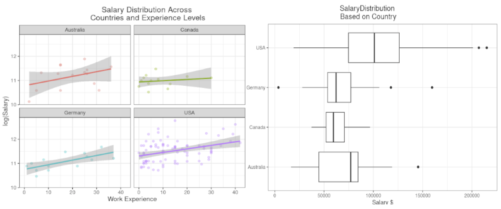

# Portfolio [ CV](/assets/img/CV.pdf)
***

### [Exploring Data Analyst Opportunities: A Job Market Analysis](assets/img/Stackflow-survey.html)
- Utilized Rstudio IDE to transform and visualize Stack Overflow 2023 Annual Survey Data.
- Performed a statistical analysis using t-test to compare the mean salaries between two regions.
- Published [results](assets/img/Stackflow-survey.html) using R markdown to create a fully reproducible and readable workflow.

***

### [Labour Market Analysis Dashboard](/assets/img/LFS.pdf)
- Created two Power BI dashboards to visualize market trends using data from labour force surveys.
- Employed Power Query and DAX to generate new columns and measures for dashboard visuals.
- Identified key factors contributing to unemployment and integrated R scripts within Power BI.

***
      
### [Supply Chain Performance Metrics Dashboard](https://public.tableau.com/views/SupplyChainDelayDashboard/SalesDashboard?%3Alanguage=en-GB&%3Asid=&%3Adisplay_count=n&%3Aorigin=viz_share_link)
- Transformed and filtered company sales data by using vlookup and filtering functions in Excel.
- Created [two dashboards](https://public.tableau.com/views/SupplyChainDelayDashboard/CustomerDashboard?%3Alanguage=en-GB&%3Asid=&%3Adisplay_count=n&%3Aorigin=viz_share_link) with Tableau to provide summary-orientated and detailed visualization.
- Published the results in a [blog](https://medium.com/@hasan.ahmedmonjurul/impact-of-manufacturing-delay-on-supply-chain-21d361d3a52e) and presented in [Google slides](https://docs.google.com/presentation/d/1qDbkRi0fRQCddEX93SUskXDL-I_XaL3aitj6nPYKeKc/edit?usp=sharing).

***

### Certificates
1. Microsoft Power BI Data Analyst Professional Certificate (_In Progress_)
   * [Preparing Data for Analysis with Microsoft Excel](/assets/img/C2_1.pdf) (_May 2024_)
   * [Harnessing the Power of Data with Power BI](/assets/img/C2_2.pdf) (_June 2024_)
   * [Extract, Transform and Load Data in Power BI](/assets/img/C2_3.pdf) (_June 2024_)
   * [Data Modeling in Power BI](/assets/img/C2_4.pdf) (_June 2024_)
   * [Data Analysis and Visualization with Power BI](/assets/img/C2_5.pdf) (_June 2024_)
2. Google Data Analytics Professional Certificate (_In Progress_)
   * [Foundations: Data, Data, Everywhere](/assets/img/C3_1.pdf)(_Jan 2023_)
   * [Ask Questions to Make Data-Driven Decisions](/assets/img/C3_2.pdf)(_Jan 2023_)
   * [Data Analysis with R Programming](/assets/img/C3_7.pdf)(_June 2024_)
3. [Unilever Supply Chain Data Analyst Professional Certificate](/assets/img/P1.pdf)(_June 2024_) 
   * [Supply Chain Management and Analytics](/assets/img/C1.pdf) (_May 2024_)
   * [Using Data Analytics in Supply Chain](/assets/img/C1.pdf) (_May 2024_)
   * [Implementing Supply Chain Analytics](/assets/img/C3.pdf) (_May 2024_)
   * [Supply Chain Software Tools](/assets/img/C4.pdf)(_June 2024_)
 4. [Data Analyst Nanodegree](/assets/img/C5_1.pdf)(_May 2020_)
 5. [Data Scientist Nanodegree](/assets/img/C4_1.pdf)(_Dec 2019_)    

- 
