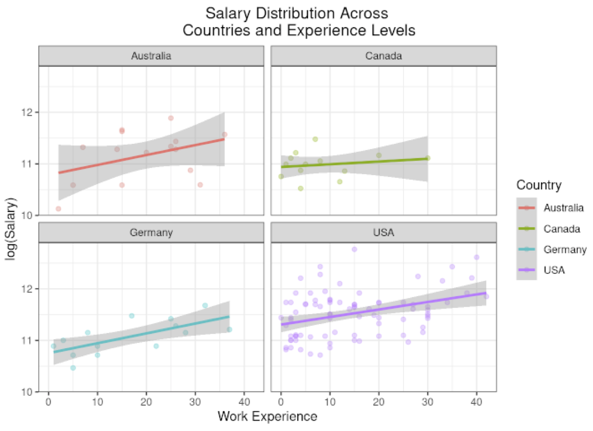

# Portfolio

### Project

- Exploring Data Analyst Opportunities: A Market Analysis
    - Utilized rstudio IDE to transform and visualize Stack Overflow 2023 Annual Survey Data.
    - Performed a statistical analysis using t-test to compare the mean salaries between two regions.
    - Published results using R markdown to create a fully reproducible and readable workflow.
      
- [Impact of Manufacturing Delay on Supply Chain](https://medium.com/@hasan.ahmedmonjurul/impact-of-manufacturing-delay-on-supply-chain-21d361d3a52e)
    - Transformed and filtered data by using vlookup and filtering functions in Excel.
    - Created two dashboards with Tableau to provide summary-orientated and detailed visualization.
    - Published the results in a blog and presented in Google slides.

### Certification
1. [Unilever Supply Chain Data Analyst Professional Certificate](/assets/img/P1.pdf)(_June 2024_) 
   * [Supply Chain Management and Analytics](/assets/img/C1.pdf) (_May 2024_)
   * [Using Data Analytics in Supply Chain](/assets/img/C1.pdf) (_May 2024_)
   * [Implementing Supply Chain Analytics](/assets/img/C3.pdf) (_May 2024_)
   * [Supply Chain Software Tools](/assets/img/C4.pdf)(_June 2024_)
     

- 
